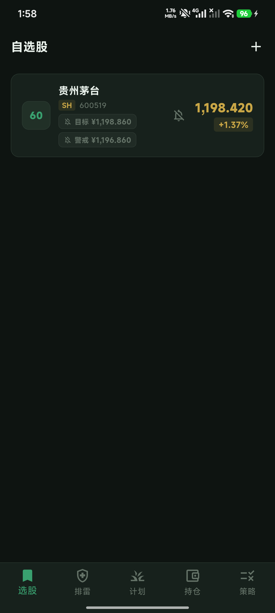
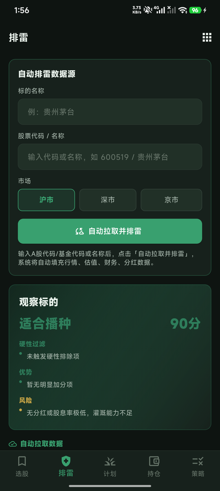
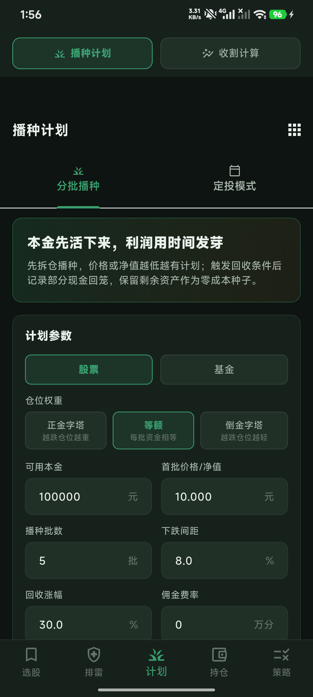
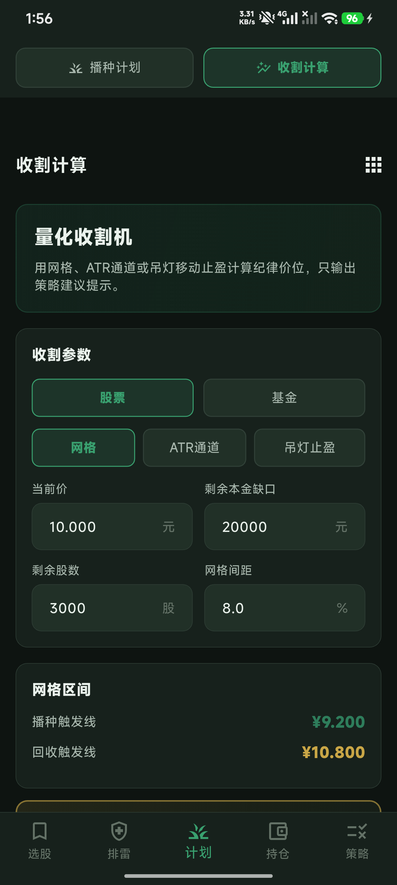
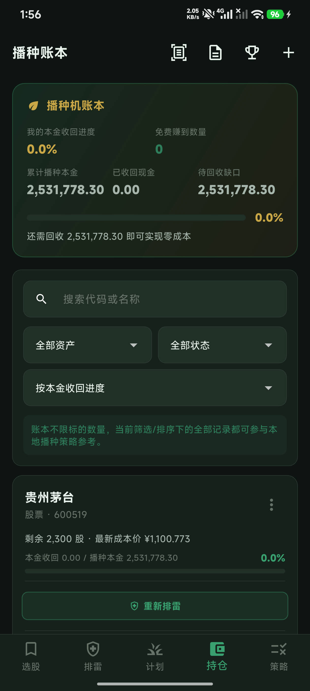
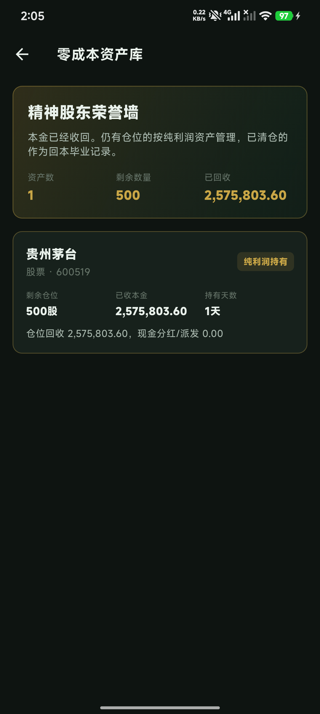

# 零成本持仓助手

面向 A 股股票、场内基金个人持仓管理的 Flutter 移动端应用。项目围绕“排雷筛选 → 播种计划 → 播种账本 → 收割回收 → 零成本留存”的流程设计，提供本地记账、分批建仓计划、回收测算、价格提醒和行情辅助分析。

> 无后端、无登录、不接交易接口。账本数据存储在本机 SQLite，行情和财务数据来自第三方公开数据源，仅用于辅助参考。

## 应用截图

| 选股 | 排雷 |
| --- | --- |
|  |  |

| 播种计划 | 收割计算 |
| --- | --- |
|  |  |

| 播种账本 | 零成本资产库 |
| --- | --- |
|  |  |

## 核心功能

### 选股

- 搜索 A 股股票、ETF / LOF 等场内基金，支持代码与名称检索。
- 自选列表支持目标价、警戒价和提醒开关。
- 自选行情支持自动刷新，价格触达后通过本地通知提醒。
- 可进入详情页查看行情、K 线、估值参考、分红与融资信息。

### 排雷

- 输入代码或名称后自动拉取行情、估值百分位、K 线趋势、财务安全和分红数据。
- 支持股票与基金两类资产，基金会使用更适合基金的收益率、趋势和分红展示口径。
- 内置硬性一票否决项，结合 PE / PB 百分位、负债率、商誉、现金流、股息率等指标生成评分。
- 通过筛选后可直接跳转到播种计划，并携带代码、名称、价格、估值和推荐参数。
- 智能策略推荐会根据估值、趋势、波动率等特征给出播种权重、网格步长、ATR 倍数等参考。

### 计划

计划页包含两个子页：播种计划与收割计算。

**播种计划**

- 按可用本金、起始价格、批数、下跌间距、回收涨幅、佣金等参数生成分批方案。
- 支持三种仓位权重：正金字塔、等额、倒金字塔。
- 每批自动计算计划买入价、投入金额、数量、回收触发价、回收数量和零成本留存数量。
- 支持定投模式，包含每周、每两周、每月周期，以及价格上限和回弹提醒。
- 可从计划结果一键记录播种入账。

**收割计算**

- 支持网格、ATR 通道、吊灯止盈三种纪律价位模式。
- ATR 可基于 K 线自动计算，也支持手动输入。
- 可根据剩余本金缺口和持仓数量计算“卖出多少可以让剩余仓位成本归零”。
- 支持记录本次回收，也支持将低吸灌溉计划记录为新的播种批次。
- 计划价格可同步到持仓批次，参与后续触价提醒。

### 持仓

- 本地维护股票和基金的播种账本。
- 一个标的可记录多个批次，每批包含买入价、数量、佣金、日期、计划快照、现金回收、卖出回收等信息。
- 自动汇总总投入、已回收、现金分红 / 派发、剩余数量、剩余成本、零成本进度。
- 支持记录回收、修正回收、记录现金回收、删除批次、删除整个标的账本。
- 支持截图 OCR 文字粘贴解析后快速入账。
- 支持生成播种账单文本并复制。

### 策略

- 内置“选种、播种、回本、留种”的策略说明。
- 提供播种前检查项、退出红线和术语解释。
- 主要用于把操作纪律固定在应用内，避免临时情绪化修改计划。

### 零成本资产库

- 当某个标的已回收资金大于或等于总投入成本时，自动进入零成本资产库展示。
- 剩余持仓按零成本资产展示；如已全部回收，则展示回本毕业状态。

## 业务公式

```text
总投入成本 = Σ(买入价格 × 买入数量 + 佣金)
卖出回收 = Σ(卖出价格 × 卖出数量)
现金回收 = 分红、派发或其他现金回笼
已回收资金 = 卖出回收 + 现金回收
零成本进度 = 已回收资金 / 总投入成本
是否零成本 = 已回收资金 >= 总投入成本
剩余数量 = 买入数量 - 已卖出数量
剩余成本 = max(总投入成本 - 已回收资金, 0)
剩余成本价 = 剩余成本 / 剩余数量
```

## 技术栈

| 分类 | 技术 |
| --- | --- |
| 跨端框架 | Flutter 3.x |
| 语言 | Dart 3 |
| 状态管理 | flutter_riverpod、riverpod_annotation |
| 本地数据库 | sqflite、path |
| 网络请求 | dio、dio_cache_interceptor |
| 编码处理 | gbk_codec |
| 图表 | k_chart、fl_chart |
| 本地通知 | flutter_local_notifications |
| 本地偏好 | shared_preferences |
| UI 辅助 | shimmer、flutter_slidable、percent_indicator、badges、iconsax |

## 数据源

项目通过 `lib/services/stock_api_service.dart` 统一封装数据访问。

| 数据 | 说明 |
| --- | --- |
| 行情 | 优先腾讯 sqt，失败后降级到新浪、聚合数据、东方财富 |
| 搜索 | 东方财富 suggest 接口 |
| K 线 | 新浪、腾讯、东方财富等公开接口 |
| 指数 / 北向资金 | 东方财富接口 |
| 财务 / 分红 / 融资 | 新浪、东方财富、聚合数据等公开数据源 |
| 可选增强 | 聚合数据 `JUHE_STOCK_KEY`，通过 `--dart-define` 注入 |

启用聚合数据示例：

```bash
flutter run --dart-define=JUHE_STOCK_KEY=your_key_here
flutter build apk --release --dart-define=JUHE_STOCK_KEY=your_key_here
```

公开接口可能受网络、频率、字段变更影响。生产或商业使用应接入具备授权的金融数据服务。

## 项目结构

```text
lib/
├── main.dart                         # 应用入口、主题、本地化、服务初始化
├── navigation/
│   └── app_navigation.dart           # 底部导航和跨页跳转
├── theme/
│   └── app_theme.dart                # 深色主题与颜色定义
├── models/
│   ├── stock.dart                    # 行情、指数等模型
│   ├── watchlist.dart                # 自选与 K 线模型
│   ├── stock_context.dart            # 跨页面传递的标的上下文
│   ├── holding_batch.dart            # 播种批次、账本、聚合持仓
│   └── dividend_financing.dart       # 分红与融资模型
├── database/
│   └── database_helper.dart          # SQLite 建表、迁移、CRUD
├── providers/
│   ├── stock_providers.dart          # 自选、搜索、行情状态
│   └── holding_providers.dart        # 持仓账本状态
├── services/
│   ├── api_config.dart               # 数据源与可选 key 配置
│   ├── stock_api_service.dart        # 行情、搜索、K 线、财务数据
│   ├── atr_service.dart              # Wilder ATR 计算
│   ├── notification_service.dart     # 本地通知
│   ├── alert_polling_service.dart    # 交易时段价格轮询
│   └── strategy_advisor_service.dart # 策略参数推荐
├── screens/
│   ├── home_screen.dart              # 底部导航与计划页双 Tab
│   ├── watchlist_screen.dart         # 自选股
│   ├── search_screen.dart            # 搜索
│   ├── stock_detail_screen.dart      # 标的详情
│   ├── seed_screening_screen.dart    # 排雷
│   ├── seed_plan_screen.dart         # 播种计划、定投模式
│   ├── harvest_calculator_screen.dart# 收割计算
│   ├── holding_tracker_screen.dart   # 播种账本
│   ├── add_holding_batch_screen.dart # 记录播种
│   ├── zero_cost_vault_screen.dart   # 零成本资产库
│   ├── market_screen.dart            # 市场概览
│   └── strategy_screen.dart          # 策略说明
└── utils/
    └── formatters.dart               # 金额、数量、日期格式化
```

其他目录：

```text
android/                 # Android 工程
ios/                     # iOS 工程
assets/                  # 静态资源
tools/                   # 图标等辅助脚本
build*.sh                # 本地构建脚本
```

## 本地开发

### 环境要求

- Flutter 3.x
- Dart SDK 3.x
- Android Studio / Android SDK
- Xcode，仅 iOS 构建需要
- JDK 17，Android Gradle 构建脚本默认使用 `/Library/Java/JavaVirtualMachines/temurin-17.jdk/Contents/Home`

检查环境：

```bash
flutter doctor
```

安装依赖：

```bash
flutter pub get
```

运行到已连接的模拟器或真机：

```bash
flutter run
```

## 构建

项目提供统一构建脚本：

```bash
./build.sh android debug
./build.sh android release
./build.sh ios debug
./build.sh ios release
./build.sh all release
```

Android 构建并安装到已连接设备：

```bash
./build.sh android debug --install
```

也可以直接使用平台脚本：

```bash
./build_android_debug.sh
./build_android_release.sh
./build_ios_debug.sh
./build_ios_release.sh
```

常见输出位置：

```text
build/app/outputs/apk/debug/ZeroCostHolding-v<version>-debug.apk
build/app/outputs/apk/release/ZeroCostHolding-v<version>-release.apk
build/ios/iphonesimulator/Runner.app
build/ios/ipa/*.ipa
```

iOS Release 需要在 Xcode 中配置签名。`build_ios_release.sh` 支持通过环境变量传入：

```bash
TEAM_ID=<your-team-id> BUNDLE_ID=<bundle-id> ./build_ios_release.sh
```

## 本地数据

SQLite 数据库文件名为 `stock_holding.db`，主要表：

| 表 | 用途 |
| --- | --- |
| `watchlist` | 自选股、目标价、警戒价、提醒开关 |
| `holding_ledgers` | 标的账本索引 |
| `holding_batches` | 播种批次、计划快照、回收记录、提醒价格 |

数据库 schema 当前版本为 `14`，启动时会自动补齐缺失字段并执行迁移。

## 价格提醒

- 轮询服务只在周一至周五 `09:25-15:05` 运行。
- 默认每 3 分钟轮询一次。
- 自选股支持目标价、警戒价提醒。
- 持仓批次支持回收触发、零成本收割、灌溉低吸提醒。
- 通知由 `flutter_local_notifications` 在本机触发。

## 开发检查

```bash
flutter analyze
flutter test
```

当前仓库的 `test/` 目录为空或仅保留占位内容时，`flutter test` 可能没有实际业务用例覆盖。新增核心公式、数据库迁移或跨页流程时，建议补充对应测试。

## 注意事项

- 本应用不提供交易能力，不连接券商，不自动下单。
- 所有计划、价格、数量和评分仅为计算结果或数据展示，不构成投资建议。
- 第三方公开接口可能延迟、失败或变更字段，关键数据请以交易所、上市公司公告、基金公告或持牌数据服务为准。
- 使用者需自行承担投资决策和市场风险。

## 免责声明

本项目仅用于个人学习、记录和辅助分析。股票、基金等金融资产存在价格波动、流动性风险和本金损失风险。项目输出的建仓计划、收割价格、零成本数量、评分结论、提醒通知等均不构成任何买卖建议、收益承诺、资产管理服务或投资顾问服务。
